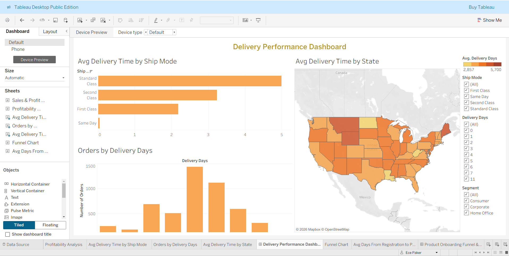
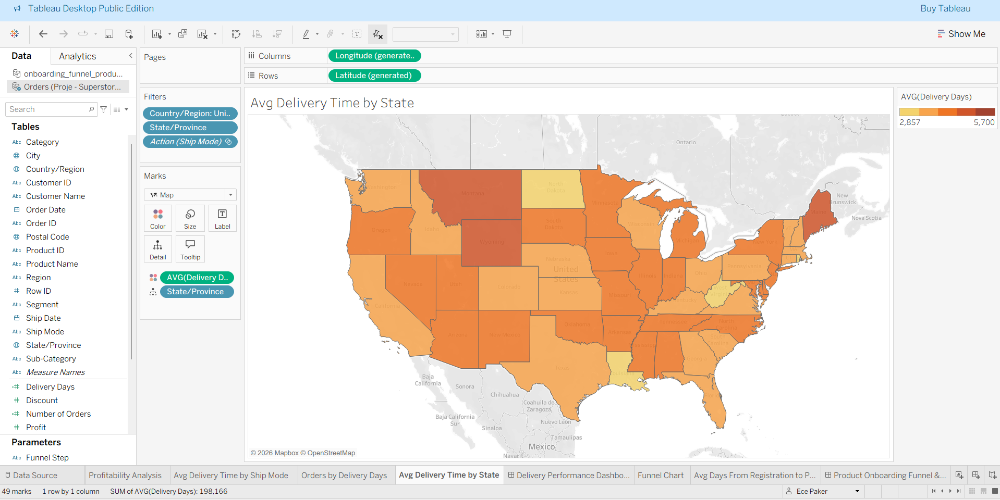

Product Onboarding Funnel Analysis (Tableau)

This project analyzes a product onboarding funnel and measures how long it takes users to convert from registration to first payment using Tableau.
The goal of the project was to practice advanced Tableau features such as LOD expressions, calculated fields, cohort analysis, parameters and dashboard actions.

🔗 Tableau Dashboard:
https://public.tableau.com/views/ProductOnboardingFunnelTimetoFirstPayment/SalesProfitTimeSeries?:language=en-US&:sid=&:redirect=auth&:display_count=n&:origin=viz_share_link

## 📊 Dashboard Screenshots

### Product Onboarding Funnel Dashboard

### Profitability Analysis

### Delivery Performance Dashboard

### Avg Delivery Time by State

Project Overview

Understanding user onboarding is critical for product growth.
This analysis answers two key questions:
How many users complete the onboarding funnel?
How long does it take users to make their first payment?
The dataset contains product event logs including:
registration
trial start
email verification
profile completion
setup completion
first payment

Analysis Steps
1️⃣ Creating Funnel Step Flags (User Level)
Because the dataset is event-based, each user appears multiple times.
To build a funnel, user-level flags were created using LOD expressions.
Example:
{ FIXED [user_id] :
MAX( IF [event] = 'registration' THEN 1 ELSE 0 END )
}

Created fields:
Has Registration
Has Trial Start
Has First Payment
These fields convert event data into user-level funnel indicators.

2️⃣ Funnel Completion Metric
Users who completed the full funnel were calculated:
COUNTD(
IF [Has Registration] = 1
AND [Has Trial-Start] = 1
AND [Has First-Payment] = 1
THEN [user_id] END)
Result:
243 users completed the full onboarding funnel

3️⃣ Time to First Payment Calculation
Calculated the number of days between registration and first payment:
DATEDIFF('day', [Registration Date], [First Payment Date])
This metric measures conversion speed.

4️⃣ Cohort Analysis
Users were grouped by Registration Month to analyze:
How conversion speed changes over time
Whether newer cohorts convert faster or slower
Chart created:
Avg Days from Registration → Payment by Month

5️⃣ Interactive Dashboard (Parameters + Actions)
The dashboard was made interactive using Parameter Actions.
When the user clicks a funnel step:
The time-to-payment chart dynamically updates
The metric recalculates based on the selected step
This creates an exploratory product analytics dashboard.

Dashboard Features
Funnel visualization
Conversion speed analysis
Cohort analysis
Interactive filtering via dashboard actions

Tools Used
Tableau Public
LOD Expressions
Calculated Fields
Parameters
Dashboard Actions

Project Purpose
This project was completed as part of a Data Analyst Bootcamp to practice real-world Tableau analytics and dashboard design.

