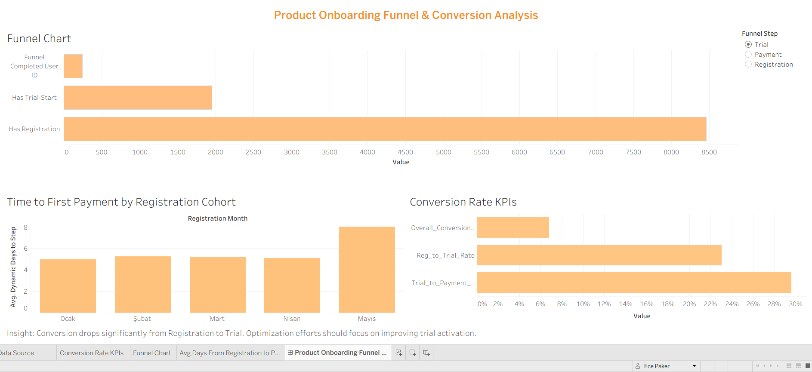

# PRODUCT ONBOARDING FUNNEL & CONVERSİON ANALYSIS (Tableau)

## Overview
This project analyzes a product onboarding journey to evaluate user progression from registration to first payment.
The objective is to identify conversion bottlenecks, measure activation efficiency, and analyze time-to-conversion across cohorts.
The analysis is built using Tableau and enhanced with calculated fields, LOD expressions, parameters, and interactive dashboard actions.
Dataset: Public product event dataset used for analytical exploration and extended with additional calculated metrics.

## Funnel Structure
User journey analyzed:
Registration
Trial Start
First Payment
Funnel Completion

Approximate volume:
~8.4K registered users
~2K trial starts
~600–700 first payments

## Task 1 – Funnel Conversion Analysis

### Objective
Measure user drop-offs between funnel stages.

### Implementation
User-level funnel flags were created using FIXED LOD expressions:
- Has Registration
- Has Trial-Start
- Has First-Payment
Example (First Payment flag):
{ FIXED [user_id] :
    MAX(
        IF [event] = 'first-payment' THEN 1 ELSE 0 END
    )
}
Conversion rates were calculated as:
- Reg_to_Trial_Rate = SUM([Has Trial-Start]) / SUM([Has Registration])
- Trial_to_Payment_Rate = SUM([Has First-Payment]) / SUM([Has Trial-Start])
- Overall_Conversion_Rate = SUM([Has First-Payment]) / SUM([Has Registration])

This ensures aggregation at the user level before calculating rates.

## Task 2 – Cohort-Based Time to First Payment

### Objective
Analyze how long users take to convert after registration.

### Cohort Definition
Users were grouped by Registration Month using:
- DATETRUNC('month', [Registration Date])

### Time Calculation
Time to First Payment was calculated using date differences between registration and first payment events.
The dataset included parsed dates (DATEPARSE used in preprocessing), and average days were analyzed by cohort.
This analysis reveals conversion speed trends across monthly user cohorts.

## Task 3 – Interactive Funnel Step Analysis

### Objective
Enable dynamic recalculation of conversion time depending on selected funnel step.

### Implementation
A Parameter (Funnel Step) was created:
- Registration
- Trial
- Payment
A dynamic calculated field adjusts the number of days based on the selected step.
Dashboard Action ensures that when a user selects a funnel stage, the cohort analysis updates automatically.
This simulates real-world product analytics exploration.

## Dashboard Components
Funnel Chart
Conversion Rate KPIs
Time to First Payment by Registration Cohort
Funnel Step Parameter (interactive control)
All visuals are integrated into a single interactive dashboard.

## Key Insights
The largest drop occurs between Registration and Trial activation.
Trial-to-Payment conversion performs significantly stronger than Registration-to-Trial.
Later cohorts show variations in conversion speed, indicating potential onboarding optimization opportunities.

## Recommendation:
Optimization efforts should focus on improving trial activation rates.

## Tools Used
Tableau Public
FIXED LOD Expressions
Calculated Fields
Parameters
Dashboard Actions
Cohort Analysis

## Tableau Public Dashboard Link
https://public.tableau.com/views/ProductOnboardingFunnelConversionAnalysis/ProductOnboardingFunnelConversionAnalysis?:language=en-US&publish=yes&:sid=&:redirect=auth&:display_count=n&:origin=viz_share_link

## Dashboard Preview

